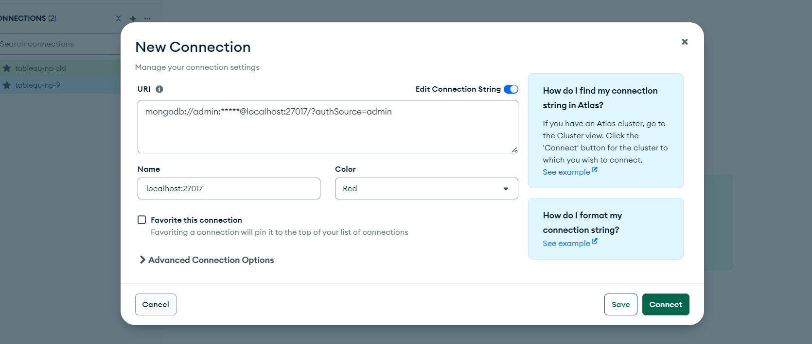
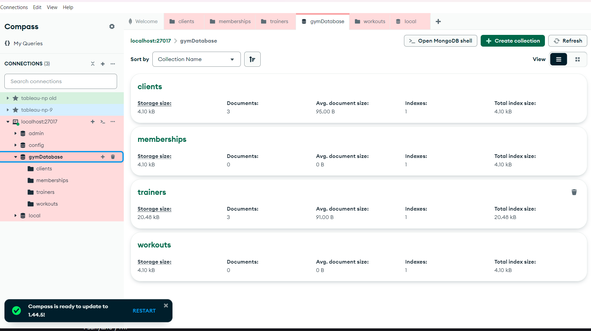

# lesson_14
# NoSQL
# Run Docker mongodb

```
PS C:\DevOps\mongodb> docker run --name mongo -d -p 27017:27017 -e MONGO_INITDB_ROOT_USERNAME=admin -e MONGO_INITDB_ROOT_PASSWORD=***** -v ~/mongo-data:/data/db mongo:8

PS C:\DevOps\mongodb> docker ps
CONTAINER ID   IMAGE     COMMAND                  CREATED          STATUS          PORTS                      NAMES

a21378bf9903   mongo:8   "docker-entrypoint.s…"   16 seconds ago   Up 14 seconds   0.0.0.0:27017->27017/tcp   mongo

PS C:\DevOps\mongodb> docker exec -it mongo mongosh -u admin --authenticationDatabase admin
Enter password: *****
```
Mongodb-compass


# Створення бази даних та колекцій:
## Назвіть базу даних як gymDatabase
```
test> use gymDatabase
switched to db gymDatabase
```


### Створіть колекції: clients, memberships, workouts, trainers

```
gymDatabase> db.createCollection("clients")
{ ok: 1 }
gymDatabase> db.createCollection("memberships")
{ ok: 1 }
gymDatabase> db.createCollection("workouts")
{ ok: 1 }
gymDatabase> db.createCollection("trainers")
{ ok: 1 }
```

# Визначення схеми документів:
Clients: client_id, name, age, email
Memberships: membership_id, client_id, start_date, end_date, type
Workouts: workout_id, description, difficulty
Trainers: trainer_id, name, specialization
# Заповнення колекцій даними:
Додайте кілька записів до кожної колекції


```
db.clients.insertMany([
    { client_id: 1, name: "Vadym Bekmukhambetov", age: 27, email: "bekmukhambetov@gmail.com" },
    { client_id: 2, name: "Mykhailo Zinchuk", age: 22, email: "zinchuk@gmail.com" },
    { client_id: 3, name: "Mariia Pylypenko", age: 25, email: "pylypenko@gmail.com.com" }
])


gymDatabase> db.memberships.insertMany([
...     { membership_id: 1, client_id: 1, start_date: new Date("2023-08-04"), end_date: new Date("2025-01-04"), typtype: "annual" },
...     { membership_id: 2, client_id: 2, start_date: new Date("2023-10-01"), end_date: new Date("2024-11-31"), typtype: "semi-annual" },
...     { membership_id: 3, client_id: 3, start_date: new Date("2024-03-01"), end_date: new Date("2024-10-24"), typtype: "annual" }
... ])
{
  acknowledged: true,
  insertedIds: {
    '0': ObjectId('671f83b090dd466d1efe6914'),
    '1': ObjectId('671f83b090dd466d1efe6915'),
    '2': ObjectId('671f83b090dd466d1efe6916')
  }
}
gy


gymDatabase> db.workouts.insertMany([
...     { workout_id: 1, description: "Strength training", difficulty: "high" },
...     { workout_id: 2, description: "Strength training", difficulty: "high" },
...     { workout_id: 3, description: "Strength training", difficulty: "low" }
... ])
{
  acknowledged: true,
  insertedIds: {
    '0': ObjectId('671f83b790dd466d1efe6917'),
    '1': ObjectId('671f83b790dd466d1efe6918'),
    '2': ObjectId('671f83b790dd466d1efe6919')
  }
}


gymDatabase> db.trainers.insertMany([
...     { trainer_id: 1, name: "Bohdan Boklan", specialization: "Cardio" },
...     { trainer_id: 2, name: "Bohdan Boklan", specialization: "Strength training" },
...     { trainer_id: 3, name: "Bohdan Boklan", specialization: "Trx" }
... ])
{
  acknowledged: true,
  insertedIds: {
    '0': ObjectId('671f843090dd466d1efe691a'),
    '1': ObjectId('671f843090dd466d1efe691b'),
    '2': ObjectId('671f843090dd466d1efe691c')
  }
}
```

# Запити:
Знайдіть всіх клієнтів віком понад 30 років
```
gymDatabase> db.clients.find({ age: { $gt: 30 } })

gymDatabase> db.clients.find({ age: { $gt: 24 } })
[
  {
    _id: ObjectId('671f5daa90dd466d1efe6911'),
    client_id: 1,
    name: 'Vadym Bekmukhambetov',
    age: 27,
    email: 'bekmukhambetov@gmail.com'
  },
  {
    _id: ObjectId('671f5daa90dd466d1efe6913'),
    client_id: 3,
    name: 'Mariia Pylypenko',
    age: 25,
    email: 'pylypenko@gmail.com.com'
  }
]
```

Перелічіть тренування із середньою складністю

```
gymDatabase> db.workouts.find({ difficulty: "medium" })
gymDatabase> db.workouts.find({ difficulty: "low" })
[
  {
    _id: ObjectId('671f83b790dd466d1efe6919'),
    workout_id: 3,
    description: 'Strength training',
    difficulty: 'low'
  }
]
```

Покажіть інформацію про членство клієнта з певним client_id

```
gymDatabase> db.memberships.find({ client_id: 1 })
[
  {
    _id: ObjectId('671f83b090dd466d1efe6914'),
    membership_id: 1,
    client_id: 1,
    start_date: ISODate('2023-08-04T00:00:00.000Z'),
    end_date: ISODate('2025-01-04T00:00:00.000Z'),
    type: 'annual'
  }
]
```
