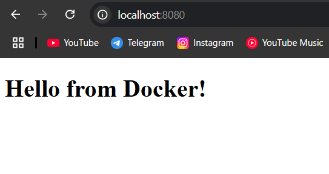
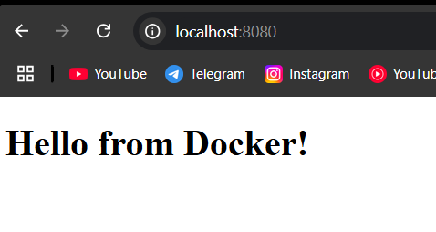

# lesson_17
# Docker-compose

#  Завдання 1: Встановлення Docker

Docker на моїй системі вже був встановлений, тому встановлення пропускаю..

#  Завдання 2: Створення файлу docker-compose.yml 

1. Створіть новий каталог для вашого проєкту:
  * Назвіть його, наприклад, multi-container-app
2. Створіть docker-compose.yml файл:
  * У цьому файлі буде визначено конфігурацію для вебсервера, бази даних та кешу
  * Додайте до docker-compose.yml файлу образи nginx, postgres та redis
  * Додайте volume db-data для postgresql, та web-data для nginx
  * Додайте спільну мережу appnet
  * Створіть файл index.html з простим змістом і додайте до web-data приклад коду:
```
<!DOCTYPE html>
   <html>
   <head>
    <title>My Docker App</title>
   </head>
   <body>
     <h1>Hello from Docker!</h1>
   </body>
   </html>
```

Перший варіант docker-compose виглядав так, тільки замість postgres вибрав mysql, тому що хотів стробувати розвернути базу з дамп файла, що робили на попередній лекції.

```
version: '3.8'

services:
  web:
    image: nginx
    volumes:
      - ./web-data/:/usr/share/nginx/html/
    networks:
      - appnet
    ports:
      - "8080:80" 

  db:
    image: mysql
    environment:
      MYSQL_ROOT_USER: admin
      MYSQL_ROOT_PASSWORD: *****
    volumes:
      - ./db-data:/var/lib/mysql
      - ./db-init:/docker-entrypoint-initdb.d 
    networks:
      - appnet

  cache:
    image: redis
    networks:
      - appnet

volumes:
  db-data:
  web-data:

networks:
  appnet:
```


#  Завдання 3: Запуск багатоконтейнерного застосунку

1. Запустіть застосунок за допомогою Docker Compose:
  * Використовуйте команду docker-compose up -d для запуску всіх сервісів у фоновому режимі
```
PS C:\DevOps\DevOpsLecture\Lecture_17\multi-container-app> docker-compose up -d
[+] Running 4/4
 ✔ Network multi-container-app_appnet            Created                    0.1s
 ✔ Container multi-container-app-db-1            Started                    1.3s
 ✔ Container multi-container-app-web-1           Started                    1.3s
 ✔ Container multi-container-app-cache-1         Started                    1.3s
```
2. Перевірте стан запущених сервісів:
  * Застосовуйте команду docker-compose ps для перегляду стану запущених контейнерів
```
PS C:\DevOps\DevOpsLecture\Lecture_17\multi-container-app> docker-compose ps

NAME                                 IMAGE     COMMAND                  SERVICE        CREATED              STATUS              PORTS
multi-container-app-cache-1          redis     "docker-entrypoint.s…"   cache          About a minute ago   Up About a minute   6379/tcp
multi-container-app-db-1             mysql     "docker-entrypoint.s…"   db             About a minute ago   Up About a minute   3306/tcp, 33060/tcp               
multi-container-app-web-1            nginx     "/docker-entrypoint.…"   web            About a minute ago   Up About a minute   0.0.0.0:8080->80/tcp
```
3. Перевірте роботу вебсервера:
  * Відкрийте браузер та перейдіть за адресою http://localhost:8080. Ви повинні побачити сторінку nginx.



#  Завдання 4: Налаштування мережі й томів

1. Досліджуйте створені мережі та томи:
  * Використовуйте команди docker network ls та docker volume ls для перегляду створених мереж і томів

```
PS C:\DevOps\DevOpsLecture\Lecture_17\multi-container-app> docker network ls
NETWORK ID     NAME                         DRIVER    SCOPE
6dd4d15937f5   bridge                       bridge    local
8fef5126d2f6   host                         host      local
c3ebd04b5c07   multi-container-app_appnet   bridge    local
5ad0960b843f   none                         null      local

PS C:\DevOps\DevOpsLecture\Lecture_17\multi-container-app> docker volume ls
DRIVER    VOLUME NAME
local     1d7ccea7ad6f1d591f000b575614b8f6e45e892d2563326d5b847d9accef7ba0
local     2cd14c72d90008d6f95240c477ec757e657fe78d72b200de521219b086bdac04
local     49de849590492654d23ebd3471e190a086d79c4c69b5af03874b4aad83da984a
local     68fb0047a3cbcb7f96994ff6cd04f8dd9c72740e962a384be4d238b68d71387e
local     91c2343f67b704cf535b8fa898ad0aabd21c2f0df040ea1120be4a795462af1d
local     884c530d20ed1e531373ae0c5328f26454c07ed5ec90c688cecc49d66e3bfe4f
local     2713d6eba015e7daa850f1264d7b56951e5e3cadeee3afae3104c74e8dffa22b
local     3023b0435ee30339062833a907ca0d4900f0f9c0f1ae0d9b9263b21d5c41626b
local     a397721b3c2fe1de50bc5a5d62db9a25a21f5cb32561c3a46aa817ec434e5474
local     b21e179c08cf3c7737b9702912b4518d96267790f8b798d307a8bd8d5836e2a0
local     ba8b5443635a820290fd7ab698518c55f4649b7c31212a5f67c6e73d1d5e623d
local     c434ea43c9725a5e02fe15fa374b6531848c234b3176941d46f2c155f2599bea
local     d4ef5c4695b7709fe8f3ee49485c75a7ca3d176b203054a2127f1e906e9bd017
local     da9e496405b37e439bc0f38161c2dfb9d15938f9736e235162db9380a490c863
local     ef2caf23db3e6fd3b13349cf89e677324b124a049433436fcf28fa9b86316bd6
local     f18dacfaf9109ad5e6417224b03a7cad32b205326ed12d032014386de54651a8
local     multi-container-app_web-data
```

2. Перевірте підключення до бази даних:
  * Застосовуйте команду docker exec для підключення до бази даних PostgreSQL всередині контейнера. <db_container_id> можна отримати з команди docker-compose ps.

```
PS C:\DevOps\DevOpsLecture\Lecture_17\multi-container-app> docker exec -it multi-container-app-db-1 bash 
bash-5.1# mysql -u root -p*****
mysql> SHOW DATABASES;
+--------------------+
| Database           |
+--------------------+
| information_schema |
| mysql              |
| performance_schema |
| SchoolDB           |
| sys                |
+--------------------+
5 rows in set (0.02 sec)
mysql> SHOW TABLES;
+--------------------+
| Tables_in_schooldb |
+--------------------+
| Children           |
| Classes            |
| Institutions       |
| Parents            |
+--------------------+
4 rows in set (0.00 sec)
```

#  Завдання 5: Масштабування сервісів

1. Масштабуйте вебсервер:
  * Використовуйте команду docker-compose up -d --scale web=3 для запуску трьох екземплярів вебсервера

Для цього завдання змінив docker-compose файл, додавши ще одний контейнер з лоадбалансером, щоб балансувати трафік між всіма web сервісами, які в майбутньому будуть скейлитись.

```
version: '3.8'

services:
  web:
    image: nginx
    volumes:
      - ./web-data/:/usr/share/nginx/html/
    networks:
      - appnet

  loadbalancer:
    image: nginx
    ports:
      - "8080:80" 
    volumes:
      - ./nginx.conf:/etc/nginx/nginx.conf 
    networks:
      - appnet
  db:
    image: mysql
    environment:
      MYSQL_ROOT_USER: admin
      MYSQL_ROOT_PASSWORD: admin
    volumes:
      - ./db-data:/var/lib/mysql
      - ./db-init:/docker-entrypoint-initdb.d 
    networks:
      - appnet

  cache:
    image: redis
    networks:
      - appnet

volumes:
  db-data:
  web-data:

networks:
  appnet:

```
і кофігурація nginx.conf

```
user nginx;

worker_processes auto;

events {
    worker_connections 1024;
}

http {
    upstream myapp {
        server web:80;        
    }

    server {
        listen 80;  
        location / {
            proxy_pass http://myapp; 
            proxy_set_header Host $host;
            proxy_set_header X-Real-IP $remote_addr;
            proxy_set_header X-Forwarded-For $proxy_add_x_forwarded_for;
            proxy_set_header X-Forwarded-Proto $scheme;
        }

    }
}

```
Далі запуск команди ```docker-compose up -d --scale web=3```

```
PS C:\DevOps\DevOpsLecture\Lecture_17\multi-container-app> docker-compose up -d --scale web=3
time="2024-11-03T23:24:51+02:00" level=warning msg="C:\\DevOps\\DevOpsLecture\\Lecture_17\\multi-container-app\\docker-compose.yaml: `version` is obsolete"
[+] Running 6/6
 ✔ Container multi-container-app-cache-1         Running                                             0.0s
 ✔ Container multi-container-app-web-1           Running                                             0.0s
 ✔ Container multi-container-app-loadbalancer-1  R...                                                0.0s
 ✔ Container multi-container-app-db-1            Running                                             0.0s
 ✔ Container multi-container-app-web-2           Started                                             0.6s
 ✔ Container multi-container-app-web-3           Started                                             0.9s
```
2. Перевірте стан масштабованих сервісів:
  * Використовуйте команду docker-compose ps для перегляду стану запущених контейнерів
```
PS C:\DevOps\DevOpsLecture\Lecture_17\multi-container-app> docker-compose ps
NAME                                 IMAGE     COMMAND                  SERVICE        CREATED              STATUS              PORTS
multi-container-app-cache-1          redis     "docker-entrypoint.s…"   cache          18 minutes ago       Up 18 minutes       6379/tcp
multi-container-app-db-1             mysql     "docker-entrypoint.s…"   db             18 minutes ago       Up 18 minutes       3306/tcp, 33060/tcp
multi-container-app-loadbalancer-1   nginx     "/docker-entrypoint.…"   loadbalancer   18 minutes ago       Up 18 minutes       0.0.0.0:8080->80/tcp
multi-container-app-web-1            nginx     "/docker-entrypoint.…"   web            18 minutes ago       Up 18 minutes       80/tcp
multi-container-app-web-2            nginx     "/docker-entrypoint.…"   web            About a minute ago   Up About a minute   80/tcp
multi-container-app-web-3            nginx     "/docker-entrypoint.…"   web            About a minute ago   Up About a minute   80/tcp
```

