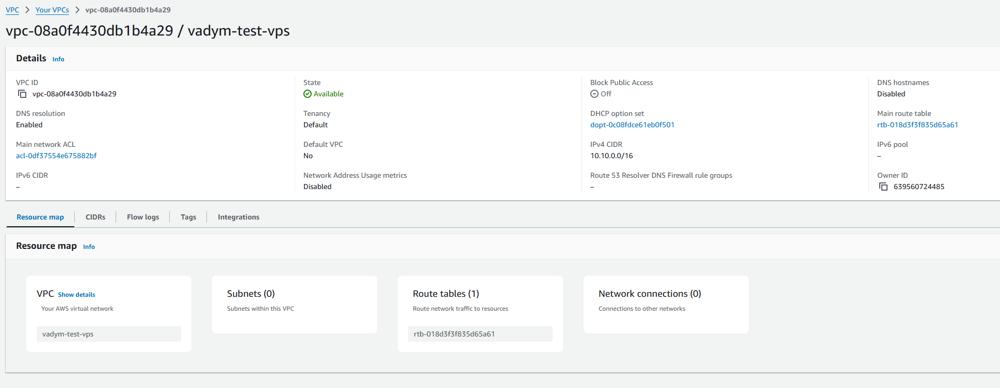
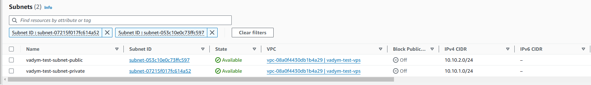
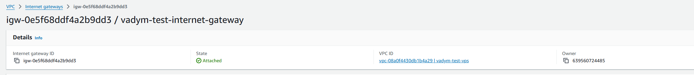
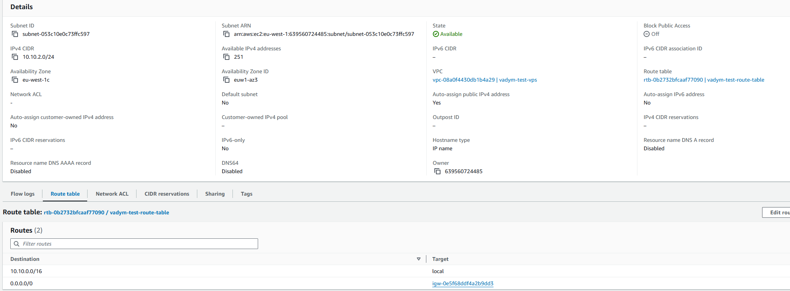
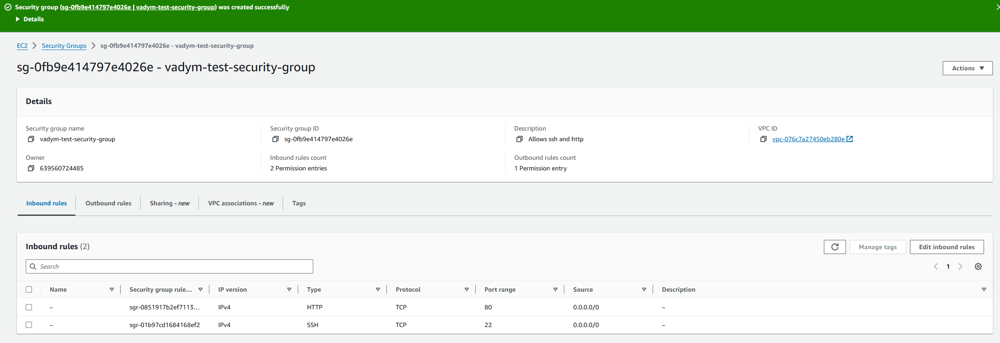
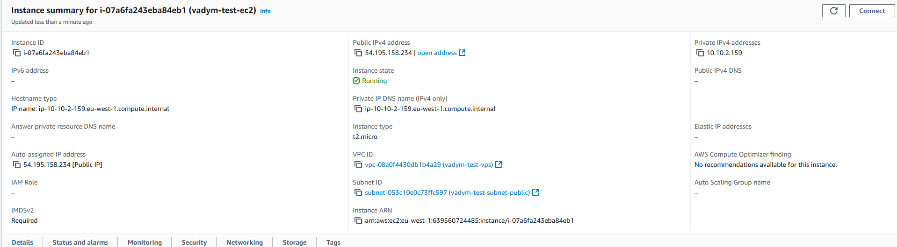
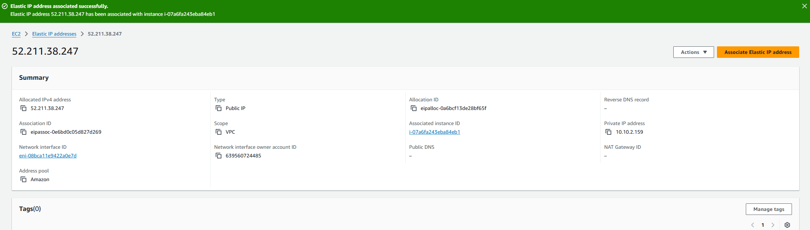
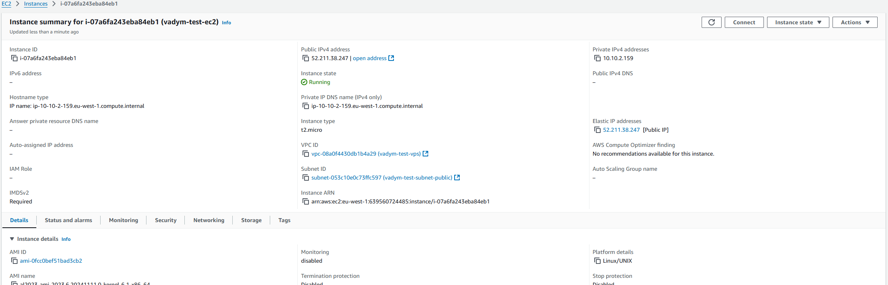

# lesson_22
# AWS Basics

## Опис
Опис завдання 

1. Створення та налаштування VPC

* Створіть нову VPC:
  * Використайте консоль AWS для створення VPC.
  * Виберіть CIDR-блок

* Створіть дві підмережі в VPC:
  * Створіть одну публічну підмережу з CIDR-блоком.
  * Створіть одну приватну підмережу з CIDR-блоком.

* Створіть та налаштуйте інтернет-шлюз (Internet Gateway):
  * Прив'яжіть інтернет-шлюз до вашої VPC.

  * Налаштуйте таблиці маршрутизації для забезпечення доступу до інтернету з публічної підмережі.

2. Налаштування груп безпеки (Security Groups) та списків контролю доступу (ACL)

* Додайте правила для дозволу вхідного HTTP та SSH трафіку з будь-якої IP-адреси.

3. Запуск інстансу EC2

* Запустіть новий інстанс EC2:
  * Використайте Amazon Linux 2 AMI.
  * Виберіть тип інстансу, наприклад, t2.micro. Оскільки він безкоштовний.
  * Прив'яжіть інстанс до публічної підмережі.
  * Використайте Security Group, створену на попередньому кроці.
  * Завантажте та використайте SSH-ключ для доступу до інстансу.

4. Призначення еластичної IP-адреси (EIP)

* Створіть та призначте EIP до вашого інстансу:
  * Створіть нову EIP в AWS консолі.
  * Прив'яжіть EIP до запущеного інстансу EC2.
  
  

