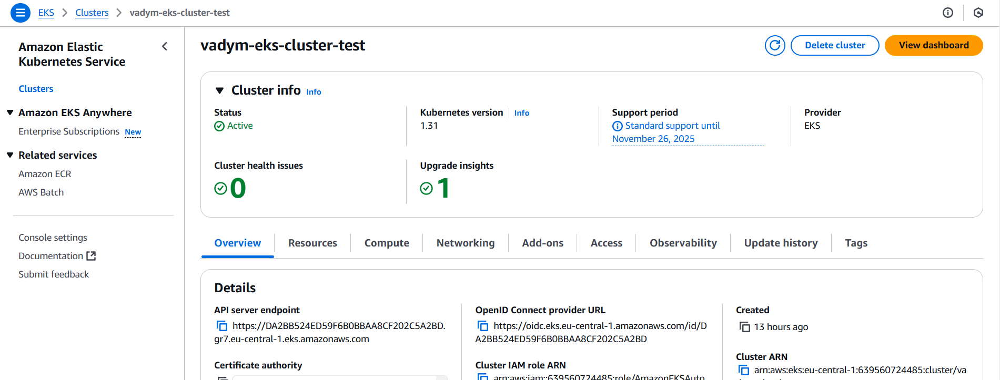
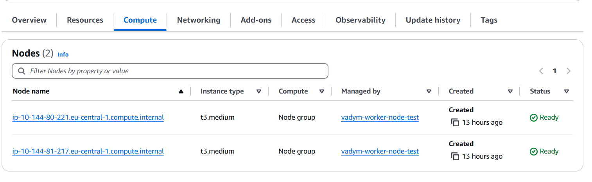
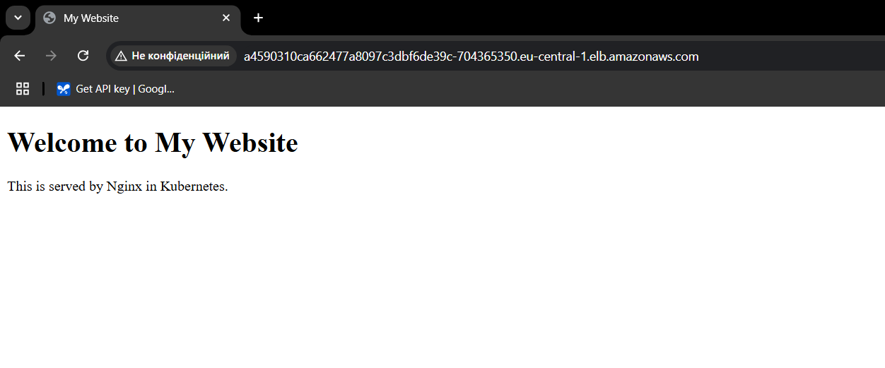

# lesson_25
## AWS EKS

1. Створити кластер EKS
  * Використовуючи AWS Management Console створено кластер EKS
  
  * Кластер повинен складається з двох воркер-нод (Node Groups) у публічній підмережі
  
  * EC2 інстанси типу t3.medium
2. Налаштувати kubectl для доступу до кластера
  * Підключено локальний kubectl до мого кластера
  * Команда kubectl get nodes показує воркер-ноди кластера

```
bekmukhambetov@ZenBook:~$ aws eks update-kubeconfig --region eu-central-1 --name vadym-eks-cluster-test
Updated context arn:aws:eks:eu-central-1:639560724485:cluster/vadym-eks-cluster-test in /home/bekmukhambetov/.kube/config

bekmukhambetov@ZenBook:~$ kubectl get nodes
NAME                                             STATUS   ROLES    AGE   VERSION
ip-10-144-80-221.eu-central-1.compute.internal   Ready    <none>   12h   v1.31.2-eks-94953ac
ip-10-144-81-217.eu-central-1.compute.internal   Ready    <none>   12h   v1.31.2-eks-94953ac
```
3. Розгорнути статичний вебсайт
  * Створіть Deployment, який розгортає статичний вебсайт на основі образу nginx
Створено конфіг файл [nginx-deployment.yaml](config_file/nginx-deployment.yaml)
  * Використовуйте ConfigMap для передачі файлів вебсайту (наприклад, index.html)
  Створено файл index.html та на його основі створено configmap. 

```
bekmukhambetov@ZenBook:~/DevOpsLecture/Lecture_25/config_file$ kubectl create configmap static-files-configmap --from-file=index.html
configmap/static-files-configmap created
bekmukhambetov@ZenBook:~/DevOpsLecture/Lecture_25/config_file$ kubectl get configmap static-files-configmap -o yaml
apiVersion: v1
data:
  index.html: |
    <!DOCTYPE html>
    <html>
    <head>
        <title>My Website</title>
    </head>
    <body>
        <h1>Welcome to My Website</h1>
        <p>This is served by Nginx in Kubernetes.</p>
    </body>
    </html>
kind: ConfigMap
metadata:
  creationTimestamp: "2024-12-07T12:43:04Z"
  name: static-files-configmap
  namespace: default
  resourceVersion: "306240"
  uid: cf3c8414-f3e3-4ffd-a9c1-5b907194a2a6 
  ```
* Розгорніть Service типу LoadBalancer, щоб зробити вебсайт доступним через публічний IP
Створено конфіг файл [nginx-service.yaml](config_file/nginx-service.yaml)
```
bekmukhambetov@ZenBook:~/DevOpsLecture/Lecture_25/config_file$ kubectl apply -f nginx-deployment.yaml
deployment.apps/nginx-deployment created
bekmukhambetov@ZenBook:~/DevOpsLecture/Lecture_25/config_file$ kubectl get pods
NAME                                READY   STATUS    RESTARTS   AGE
nginx-deployment-759d55fc68-nt6tp   1/1     Running   0          12s
nginx-deployment-759d55fc68-tctqn   1/1     Running   0          12s
bekmukhambetov@ZenBook:~/DevOpsLecture/Lecture_25/config_file$ kubectl apply -f  
service/nginx-service created
bekmukhambetov@ZenBook:~/DevOpsLecture/Lecture_25/config_file$ kubectl get service
NAME            TYPE           CLUSTER-IP    EXTERNAL-IP                                                                 PORT(S)        AGE
kubernetes      ClusterIP      172.20.0.1    <none>                                                                      443/TCP        12m
nginx-service   LoadBalancer   172.20.30.1   a4590310ca662477a8097c3dbf6de39c-704365350.eu-central-1.elb.amazonaws.com   80:30950/TCP   9s

```


4. Створити PersistentVolumeClaim для збереження даних
  * Використовуйте динамічне створення сховища (StorageClass), щоб зробити PersistentVolumeClaim

[storageclass.yaml](config_file/storageclass.yaml)
```
bekmukhambetov@ZenBook:~/DevOpsLecture/Lecture_25/config_file$ kubectl apply -f storageclass.yaml
storageclass.storage.k8s.io/ebs-sc created
bekmukhambetov@ZenBook:~/DevOpsLecture/Lecture_25/config_file$ kubectl get storageclass
NAME     PROVISIONER             RECLAIMPOLICY   VOLUMEBINDINGMODE      ALLOWVOLUMEEXPANSION   AGE
ebs-sc   ebs.csi.aws.com         Delete          WaitForFirstConsumer   false                  51s
gp2      kubernetes.io/aws-ebs   Delete          WaitForFirstConsumer   false                  19m

bekmukhambetov@ZenBook:~/DevOpsLecture/Lecture_25/config_file$ kubectl apply -f pvc.yaml
persistentvolumeclaim/ebs-pvc created
bekmukhambetov@ZenBook:~/DevOpsLecture/Lecture_25/config_file$ kubectl get pvc
NAME      STATUS    VOLUME   CAPACITY   ACCESS MODES   STORAGECLASS   VOLUMEATTRIBUTESCLASS   AGE
ebs-pvc   Pending                                      ebs-sc         <unset>                 93s
```
  [pvc.yaml](config_file/pvc.yaml)
  [pod.yaml](config_file/pod.yaml)
  * Розгорніть Pod, який застосовує цей PVC, щоб зберігати дані на EBS-диску
```
bekmukhambetov@ZenBook:~/DevOpsLecture/Lecture_25/config_file$ kubectl apply -f pod.yaml
pod/app-with-pvc created
bekmukhambetov@ZenBook:~/DevOpsLecture/Lecture_25/config_file$ kubectl get pod
NAME                                READY   STATUS    RESTARTS   AGE
app-with-pvc                        1/1     Running   0          2m
nginx-deployment-759d55fc68-kjqqp   1/1     Running   0          36m
nginx-deployment-759d55fc68-wrhgm   1/1     Running   0          36m
bekmukhambetov@ZenBook:~/DevOpsLecture/Lecture_25/config_file$ kubectl get pv
NAME                                       CAPACITY   ACCESS MODES   RECLAIM POLICY   STATUS   CLAIM             STORAGECLASS   VOLUMEATTRIBUTESCLASS   REASON   AGE
pvc-e192c9d4-97f4-4ee3-8792-f5a063c9b9fd   5Gi        RWO            Delete           Bound    default/ebs-pvc   ebs-sc         <unset>                          27s
bekmukhambetov@ZenBook:~/DevOpsLecture/Lecture_25/config_file$ kubectl get pvc
NAME      STATUS   VOLUME                                     CAPACITY   ACCESS MODES   STORAGECLASS   VOLUMEATTRIBUTESCLASS   AGE
ebs-pvc   Bound    pvc-e192c9d4-97f4-4ee3-8792-f5a063c9b9fd   5Gi        RWO            ebs-sc         <unset>                 19m
bekmukhambetov@ZenBook:~/DevOpsLecture/Lecture_25/config_file$ 
```
5. Запуск завдання за допомогою Job
  * Створіть Job, який виконує просту команду, наприклад, echo "Hello from EKS!"
[job.yaml](config_file/job.yaml)
```
bekmukhambetov@ZenBook:~/DevOpsLecture/Lecture_25/config_file$ kubectl apply -f job.yaml
job.batch/hello-job created
bekmukhambetov@ZenBook:~/DevOpsLecture/Lecture_25/config_file$ kubectl get job
NAME        STATUS     COMPLETIONS   DURATION   AGE
hello-job   Complete   1/1           6s         15s
bekmukhambetov@ZenBook:~/DevOpsLecture/Lecture_25/config_file$ kubectl get pods --selector=job-name=hello-job
NAME              READY   STATUS      RESTARTS   AGE
hello-job-9th8m   0/1     Completed   0          3m3s
bekmukhambetov@ZenBook:~/DevOpsLecture/Lecture_25/config_file$ kubectl logs hello-job-9th8m
Hello from EKS!
bekmukhambetov@ZenBook:~/DevOpsLecture/Lecture_25/config_file$ kubectl delete job hello-job
job.batch "hello-job" deleted
```
  * Переконайтеся, що Job виконується успішно
```
bekmukhambetov@ZenBook:~/DevOpsLecture/Lecture_25/config_file$ kubectl logs hello-job-9th8m
Hello from EKS!
bekmukhambetov@ZenBook:~/DevOpsLecture/Lecture_25/config_file$ kubectl delete job hello-job
job.batch "hello-job" deleted
```
6. Розгорнути тестовий застосунок
  * Розгорніть застосунок з образу httpd (Apache HTTP Server) або nginx
  * Використовуйте Deployment для створення двох реплік
  * Налаштуйте Service типу ClusterIP для доступу до застосунку всередині кластера

[httpd-deployment.yaml](config_file/httpd-deployment.yaml)
[httpd-service.yaml](config_file/httpd-service.yaml)

```
bekmukhambetov@ZenBook:~/DevOpsLecture/Lecture_25/config_file$ kubectl apply -f httpd-deployment.yaml
deployment.apps/httpd-deployment created
bekmukhambetov@ZenBook:~/DevOpsLecture/Lecture_25/config_file$ kubectl apply -f httpd-service.yaml
service/httpd-service created
bekmukhambetov@ZenBook:~/DevOpsLecture/Lecture_25/config_file$ kubectl get deployment
NAME               READY   UP-TO-DATE   AVAILABLE   AGE
httpd-deployment   2/2     2            2           53s
nginx-deployment   2/2     2            2           55m
bekmukhambetov@ZenBook:~/DevOpsLecture/Lecture_25/config_file$ kubectl get service
NAME            TYPE           CLUSTER-IP     EXTERNAL-IP                                                                 PORT(S)        AGE
httpd-service   ClusterIP      172.20.67.26   <none>                                                                      80/TCP         2m56s
kubernetes      ClusterIP      172.20.0.1     <none>                                                                      443/TCP        75m
nginx-service   LoadBalancer   172.20.30.1    a4590310ca662477a8097c3dbf6de39c-704365350.eu-central-1.elb.amazonaws.com   80:30950/TCP   62m

bekmukhambetov@ZenBook:~/DevOpsLecture/Lecture_25/config_file$ kubectl run test-busybox --image=busybox --restart=Never --rm -it -- sh
If you don't see a command prompt, try pressing enter.
/ # wget -qO- http://172.20.67.26:80
<html><body><h1>It works!</h1></body></html>
/ # 
```
7. Робота з неймспейсами
  * Створіть окремий namespace dev і розгорніть у ньому застосунок з 5 репліками на основі образу busybox. Контейнер повинен виконувати команду sleep 3600.
[busybox-deployment.yaml](config_file/busybox-deployment.yaml)
```
bekmukhambetov@ZenBook:~/DevOpsLecture/Lecture_25/config_file$ kubectl create namespace dev
namespace/dev created
bekmukhambetov@ZenBook:~/DevOpsLecture/Lecture_25/config_file$ kubectl get namespace
NAME              STATUS   AGE
default           Active   85m
dev               Active   97s
bekmukhambetov@ZenBook:~/DevOpsLecture/Lecture_25/config_file$ kubectl apply -f busybox-deployment.yaml
deployment.apps/busybox-deployment created
bekmukhambetov@ZenBook:~/DevOpsLecture/Lecture_25/config_file$ kubectl get deployments -n dev
NAME                 READY   UP-TO-DATE   AVAILABLE   AGE
busybox-deployment   5/5     5            5           3m44s
bekmukhambetov@ZenBook:~/DevOpsLecture/Lecture_25/config_file$ kubectl get pods -n dev
NAME                                  READY   STATUS    RESTARTS   AGE
busybox-deployment-75cd85d546-49vmc   1/1     Running   0          5m24s
busybox-deployment-75cd85d546-5bcfr   1/1     Running   0          5m24s
busybox-deployment-75cd85d546-7z22d   1/1     Running   0          5m24s
busybox-deployment-75cd85d546-n2xgc   1/1     Running   0          5m24s
busybox-deployment-75cd85d546-vlrkz   1/1     Running   0          5m24s
bekmukhambetov@ZenBook:~/DevOpsLecture/Lecture_25/config_file$ kubectl exec -it busybox-deployment-75cd85d546-49vmc -n dev -- sh
/ # ls
bin    dev    etc    home   lib    lib64  proc   root   sys    tmp    usr    var
/ # 
```
8. Очистити ресурси
  * Deployment, Pod, Service, PVC тощо після завершення роботи

```
bekmukhambetov@ZenBook:~/DevOpsLecture/Lecture_25/config_file$ kubectl delete all --all --all-namespaces
pod "app-with-pvc" deleted
pod "httpd-deployment-bf5c4df59-vjw8g" deleted
pod "httpd-deployment-bf5c4df59-xgzcs" deleted
pod "nginx-deployment-759d55fc68-kjqqp" deleted
pod "nginx-deployment-759d55fc68-wrhgm" deleted
pod "busybox-deployment-75cd85d546-49vmc" deleted
pod "busybox-deployment-75cd85d546-5bcfr" deleted
pod "busybox-deployment-75cd85d546-7z22d" deleted
pod "busybox-deployment-75cd85d546-n2xgc" deleted
pod "busybox-deployment-75cd85d546-vlrkz" deleted
pod "aws-node-rgm2w" deleted
pod "aws-node-wgkr9" deleted
pod "coredns-5b7fb68d97-4sxf7" deleted
pod "coredns-5b7fb68d97-dvt29" deleted
pod "ebs-csi-controller-6f6d4498b9-5mjzw" deleted
pod "ebs-csi-controller-6f6d4498b9-t4jfk" deleted
pod "ebs-csi-node-dtk2z" deleted
pod "ebs-csi-node-tkx4l" deleted
pod "eks-pod-identity-agent-nl5tb" deleted
pod "eks-pod-identity-agent-v9shb" deleted
pod "kube-proxy-9tb2w" deleted
pod "kube-proxy-xfnz4" deleted
service "httpd-service" deleted
service "kubernetes" deleted
service "nginx-service" deleted
service "eks-extension-metrics-api" deleted
service "kube-dns" deleted
daemonset.apps "aws-node" deleted
daemonset.apps "ebs-csi-node" deleted
daemonset.apps "ebs-csi-node-windows" deleted
daemonset.apps "eks-pod-identity-agent" deleted
daemonset.apps "kube-proxy" deleted
deployment.apps "httpd-deployment" deleted
deployment.apps "nginx-deployment" deleted
deployment.apps "busybox-deployment" deleted
deployment.apps "coredns" deleted
deployment.apps "ebs-csi-controller" deleted
bekmukhambetov@ZenBook:~/DevOpsLecture/Lecture_25/config_file$ eksctl delete cluster --name vadym-cluster
2024-12-07 21:08:58 [ℹ]  deleting EKS cluster "vadym-cluster"
2024-12-07 21:08:59 [ℹ]  deleted 0 Fargate profile(s)
2024-12-07 21:09:00 [ℹ]  cleaning up AWS load balancers created by Kubernetes objects of Kind Service or Ingress
2024-12-07 21:09:00 [ℹ]  1 task: { delete unowned nodegroup vadym-node-group }
2024-12-07 21:09:21 [ℹ]  waiting for all non eksctl-owned nodegroups to be deleted
2024-12-07 21:12:03 [!]  no IAM and OIDC resources were found for "vadym-cluster"
2024-12-07 21:12:04 [ℹ]  initiated deletion of cluster "vadym-cluster"
2024-12-07 21:12:04 [ℹ]  to see the status of the deletion run `eksctl get cluster --name vadym-cluster --region eu-central-1`
2024-12-07 21:12:04 [✔]  all cluster resources were deleted
```