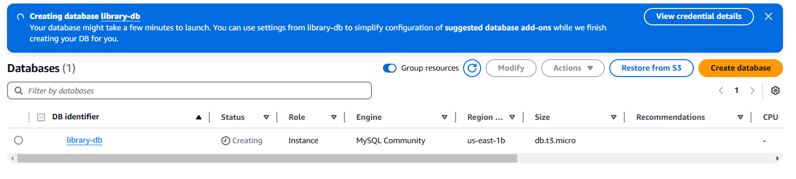
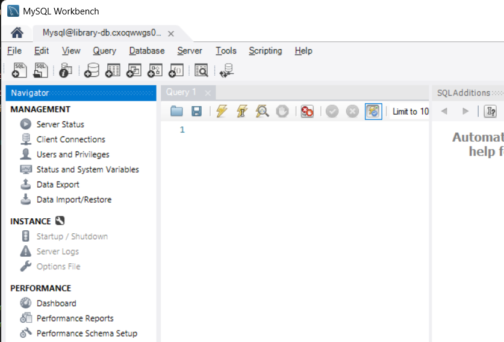
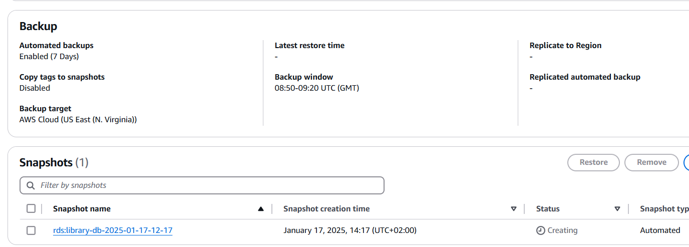
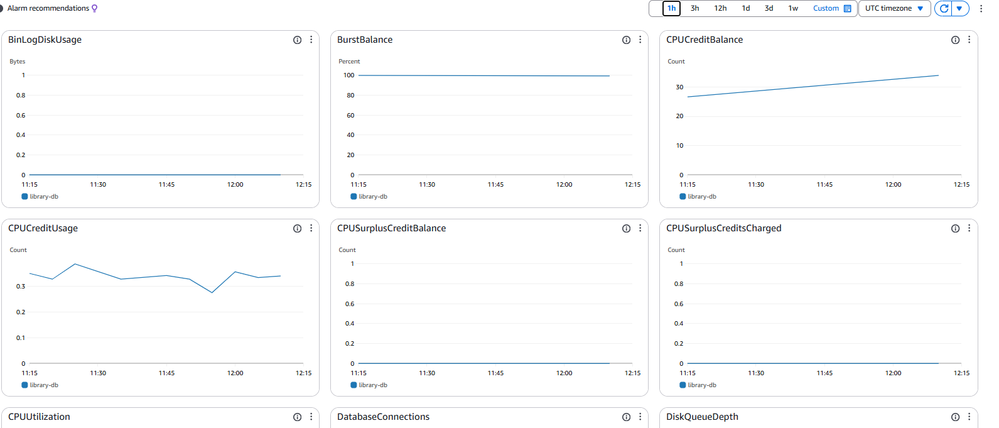

# lesson_27
# AWS DB Services

#  Завдання 1: Створення RDS інстансу

#  Завдання 2: Підключення до бази 

#  Завдання 5: Виконання запитів

```
mysql> SELECT books.title, authors.name 
    -> FROM books
    -> JOIN authors ON books.author_id = authors.id
    -> LEFT JOIN reading_status ON books.id = reading_status.book_id
    -> WHERE reading_status.status IS NULL OR reading_status.status != 'completed';
+------------------------------------------+-----------------+
| title                                    | name            |
+------------------------------------------+-----------------+
| 1984                                     | George Orwell   |
| Harry Potter and the Philosopher's Stone | J.K. Rowling    |
| Kafka on the Shore                       | Haruki Murakami |
+------------------------------------------+-----------------+
3 rows in set (0.12 sec)

mysql> SELECT COUNT(*) AS reading_books
    -> FROM reading_status
    -> WHERE status = 'reading';
+---------------+
| reading_books |
+---------------+
|             1 |
+---------------+
1 row in set (0.11 sec)
```
#  Завдання 6: Налаштування доступу
```
mysql> CREATE USER 'library_user'@'%' IDENTIFIED BY 'strong_password';
Query OK, 0 rows affected (0.14 sec)
mysql> GRANT SELECT, INSERT, UPDATE ON library.* TO 'library_user'@'%';
Query OK, 0 rows affected (0.18 sec)
mysql> FLUSH PRIVILEGES;
Query OK, 0 rows affected (0.13 sec)
```
#  Завдання 7: Моніторинг та резервне копіювання

