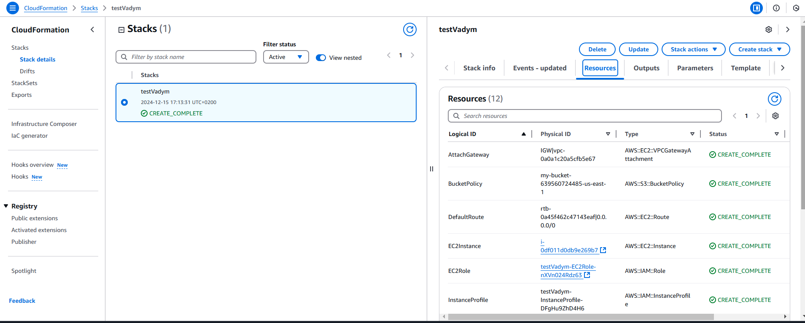

# lesson_28
## AWS CloudFormation

Створено файл з конфігурацією інфраструктури [lecture28.yml](lecture28.yml)

Створено S3 bucket, в який поміщено файл з конфігурацією.

Далі було створено Stack через AWS Console з підключенням до Amazon S3 URL.

Після старту все успішно відпрацювало та були створені всі ресурси.




Далі спробував перейменувати `myVPC` на `myVPCdr`, щоб перевірити на Drifts.


Далі спробував видалити стек через CLI:

```
bekmukhambetov@ZenBook:~$ aws cloudformation delete-stack --stack-name testVadym
```
Стек успішно видалено:

