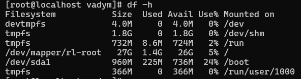

# lecture3

Оскільки Virtual Box в мене вже був встановлений, процес встановлення не зможу показати.

Відкриваємо Virtual Box


Натискаємо Створити 

Вводимо необхідні дані та обираємо iso image


Налаштовуємо параметри віртуальної машини


Додаємо проміжний адаптер


Далі процес втановлення операційної системи


Запуск команди yum update


Зловив таку хрінь (не вистачило ресурсів напевно)


Додаю ОЗУ та CPU.

_Зміна параметрів віртуальної машини, а саме збільшення озу та кількості процесорів повпливала на її продуктивність в кращу сторону_


Збільшення розміру диска з 20GB до 30GB
_На вимкненій машинці захожу в \Файл\tools\Virtual Media Manager і збільшую розмір диска з 20 до 30_


Підключився по ssh для зручності 


```
sudo parted
(parted) p
Model: ATA VBOX HARDDISK (scsi)
Disk /dev/sda: 32.2GB
Sector size (logical/physical): 512B/512B
Partition Table: msdos
Disk Flags:

Number  Start   End     Size    Type     File system  Flags
 1      1049kB  1075MB  1074MB  primary  xfs          boot
 2      1075MB  21.5GB  20.4GB  primary               lvm

(parted) resizepart 2

End?  [21.5GB]? 32.2GB

sudo pvresize /dev/sda2
sudo lvextend -r -l +100%FREE /dev/mapper/rl-root

```
Розмір диска збільшено до 30GB



Встановлення nginx і його запуск


Вроцес створення снепшоту 


Запуск команди видалення


Відновлення з снепшоту


Після відновлення все працює

_знімок допоміг відновити початковий стан системи після виконання зловісної команди rm -rf / !!!_


Налаштувати спільні папки між основною машиною і VM, щоб мати можливість обмінюватися файлами між ними.

Спершу маунтимо диск з гостьовими доповненнями


створюємо спільну папку


далі заходимо на віртуалку і маунтимо диск в систему
```
sudo mount /dev/cdrom /mnt
```
запускаємо встановлення гостьових доповнень
```
sudo /mnt/VBoxLinuxAdditions.run
```
маунтимо спільну папку
```
sudo mount -t vboxsf -o rw,uid=1000,gid=1000 share ~/host
```


звісно не все так просто, бо потрібно було пооновлювати пакети, погратись з версіями та сумісностями...