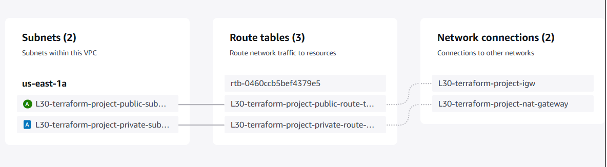
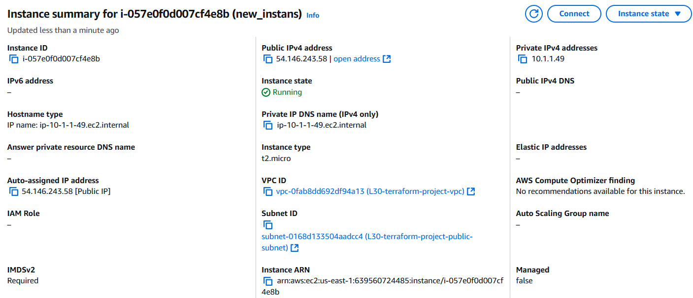
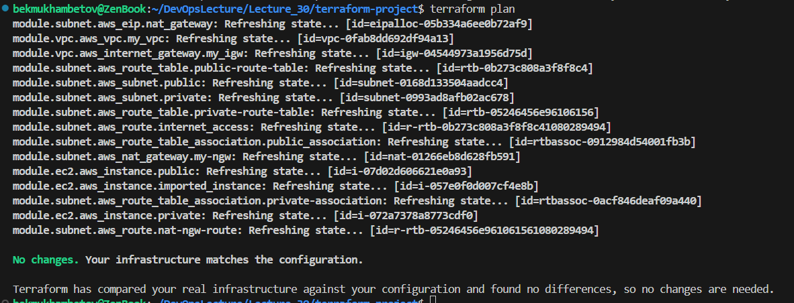
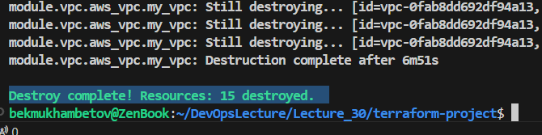

# lesson_30

# Terraform

## Опис завдання 1/2

* Створити VPC з двома серверами у публічній та приватній підмережі за допомогою Terraform, застосовуючи модулі
  * Створіть модуль для VPC
  * Створіть модуль для підмереж
  * Створіть модуль для EC2-інстансів
  * Використовуйте ці модулі в основному конфігураційному файлі для створення інфраструктури

## Структура файлів

Проєкт після створення має наступну структуру:
```
terraform-project/
├── main.tf           # Головний файл конфігурації, який підключає модулі
├── outputs.tf        # Файл для вихідних даних
├── provider.tf       # Конфігурація провайдера AWS
├── variables.tf      # Опис змінних для основного проєкту
├── terraform.tfvars  # Конкретні значення змінних для середовища
├── modules/          # Папка для модулів
│   ├── vpc/          # Модуль для створення VPC
│   │   ├── main.tf       # Основна логіка створення VPC
│   │   ├── variables.tf  # Змінні, що використовуються в модулі VPC
│   │   ├── outputs.tf    # Файл для вихідних даних
│   ├── subnet/       # Модуль для створення підмереж
│   │   ├── main.tf       # Логіка для публічної та приватної підмереж
│   │   ├── variables.tf  # Змінні для підмереж
│   │   ├── outputs.tf    # Файл для вихідних даних
│   ├── ec2/          # Модуль для створення EC2 інстансів
│       ├── main.tf       # Логіка створення EC2 інстансів
│       ├── variables.tf  # Змінні для інстансів EC2
│       ├── outputs.tf    # Файл для вихідних даних 
```

## Деталі модулів
### Модуль [VPC](terraform-project/modules/vpc/main.tf)
- Створює ізольовану мережу з вказаним CIDR-блоком.
- [Вихідні дані](terraform-project/modules/vpc/outputs.tf): `vpc_id` та `gateway_id`.

### Модуль [Subnet](terraform-project/modules/subnet/main.tf)
- Створює публічну та приватну підмережі в межах VPC.
- Використовує `vpc_id` та `gateway_id` як вхідну змінну.
- [Вихідні дані](terraform-project/modules/subnet/outputs.tf): `public_subnet_id` та `private_subnet_id`.

### Модуль [EC2](terraform-project/modules/ec2/main.tf)
- Створює два інстанси EC2:
  - Публічний інстанс (у публічній підмережі).
  - Приватний інстанс (у приватній підмережі).
- Використовує `public_subnet_id` та `private_subnet_id` як вхідну змінну.
- [Вихідні дані](terraform-project/modules/ec2/outputs.tf): `public__instance_id` та `private__instance_id`.

## Використання
1. **Ініціалізація Terraform:**
   ```bash
   terraform init
   ```
   Завантажуємо необхідні провайдери та готуємо робочий каталог.

2. **Ініціалізація Terraform:**
   ```bash
   terraform validate
   ```
   Валядуємо створені нами файли щоб переконатись чи немає невідповідностей.

3. **Попередній перегляд змін:**
   ```bash
   terraform plan
   ```
   Виводить список змін, які Terraform планує виконати.

4. **Застосування конфігурації:**
   ```bash
   terraform apply
   ```
   Виконання для створення ресурсів.

   Перевірка створених ресурсів: 
   Після виконання `terraform apply`, у вихідних даних доступні ідентифікатори створених ресурсів.
   ```bash
   Outputs:

   private_instance_id = "i-072a7378a8773cdf0"
   public_instance_id = "i-07d02d606621e0a93"
   vpc_id = "vpc-0fab8dd692df94a13"
   ```



## Опис завдання 2/2

  * Імпортувати наявні ресурси в Terraform-конфігурації
  * Створіть кілька ресурсів вручну за допомогою AWS Management Console
  
  * Імпортуйте ці ресурси у Terraform конфігураційні файли за допомогою команди terraform import
  * Переконайтеся, що Terraform створює ідентичну інфраструктуру

До модуля [EC2](terraform-project/modules/ec2/main.tf) додаємо ресурс, який потрібно імпортувати до нашого проєкту (в даному випадку ec2 інстанс). 
 ```
    resource "aws_instance" "imported_instance" {
        ami           = "ami-01816d07b1128cd2d"
        instance_type = "t2.micro"
        subnet_id     = var.public_subnet_id

        tags = {
            Name = "new-instans"
        }
    }
 ```
Для імпорту ресурсу у Terraform використовуємо команду `terraform import`: 

```bash
terraform import module.ec2.aws_instance.imported_instance i-057e0f0d007cf4e8b
``` 

* `aws_instance` — тип ресурсу, який імпортуємо.
* `imported_instance` — ім'я ресурсу в Terraform конфігурації.
* `i-057e0f0d007cf4e8b` — ID ресурсу (EC2 інстансу).

```bash
module.ec2.aws_instance.imported_instance: Importing from ID "i-057e0f0d007cf4e8b"...
module.ec2.aws_instance.imported_instance: Import prepared!
  Prepared aws_instance for import
module.ec2.aws_instance.imported_instance: Refreshing state... [id=i-057e0f0d007cf4e8b]

Import successful!

The resources that were imported are shown above. These resources are now in
your Terraform state and will henceforth be managed by Terraform.
```
Після імпорту запускаємо команду `terraform plan`, щоб перевірити опис інфраструктури на відсутність змін:



**Видалення інфраструктури:**
```bash
terraform destroy
```
Видаляє всі створені ресурси. 
При заапуску даної команди були видалені всі описані ресурси, включаючи імпортований ec2 інстанс.
