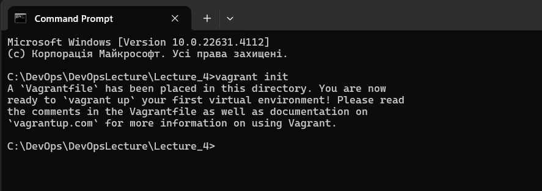
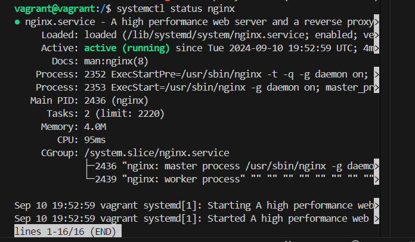
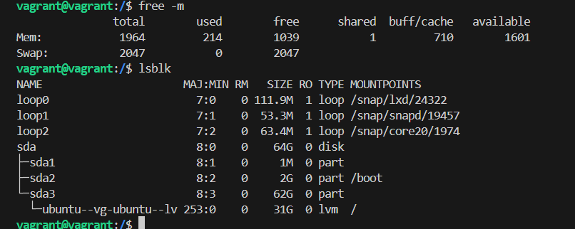
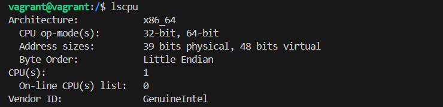
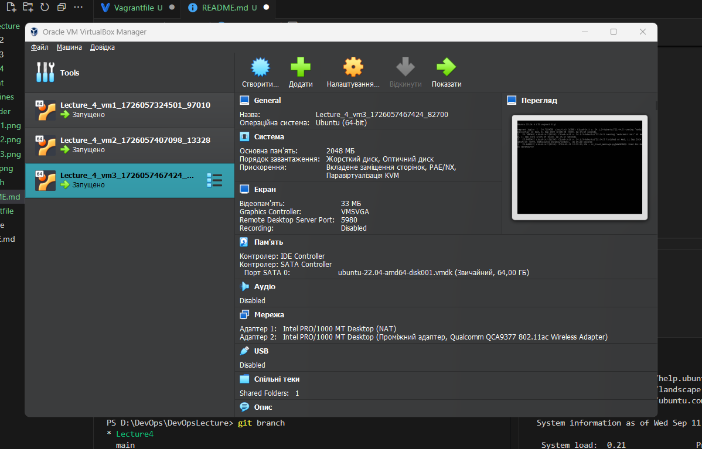

# Lecture_4

Спершу був завантажений та встановлений vagrant.

Далі в потрібній мені директорію запускаю процес ініціалізації.

```
PS C:\DevOps\DevOpsLecture\Lecture_4> vagrant init
```


Початковий vagrantfile з інструкціями встановлено.

Після чого створюю перший власний vagrantfile.
```
VM1 (загальнодоступний вебсервер):
Операційна система: на ваш вибір, особисто порекомендував би bento/ubuntu-24.04 або generic/debian12.
Мережеве під'єднання до загальнодоступної мережі з динамічним IP.
Спільна папка між хостом і VM.
Провізіонінг: Використовуйте shell-команду для оновлення та інсталювання пакетів. На даному етапі — будь-яка проста команда, bash будемо вивчати в наступних лекціях.
```
```
Vagrant.configure("2") do |config|
  config.vm.define "vm1" do |vm1|
    vm1.vm.box = "bento/ubuntu-22.04"
    vm1.vm.network "public_network"
    vm1.vm.synced_folder ".", "/lecture_4", type: "virtualbox"
    vm1.vm.provider "virtualbox" do |vb|
      vb.memory = "2048"
      vb.cpus = 1
    end
    vm1.vm.provision "shell", inline: <<-SHELL
      sudo apt-get update
      sudo apt-get install -y nginx
    SHELL
  end
end
```
Перевіряю файл на помилки.
```
PS C:\DevOps\DevOpsLecture\Lecture_4> vagrant validate
Vagrantfile validated successfully.
```
Успіх!! Тепер можна запускати віртуалку!
```
PS C:\DevOps\DevOpsLecture\Lecture_4> vagrant up 
```
Підключаюсь по ssh і перевіряю налаштування з файлу.


```
PS C:\DevOps\DevOpsLecture\Lecture_4> vagrant ssh vm1
vagrant@vagrant:/$ ll
Спільна папка - є.
drwxrwxrwx   1 vagrant vagrant       4096 Sep 10 19:25 lecture_4/ 
nginx - встановлено
2gb
1 cpu

```




Після перевірки вимикаю і видаляю vm1
```
PS C:\DevOps\DevOpsLecture\Lecture_4> vagrant destroy
    vm1: Are you sure you want to destroy the 'vm1' VM? [y/N] y
==> vm1: Forcing shutdown of VM...
==> vm1: Destroying VM and associated drives...
```

Редагую vagrantfile додаючи нові vm1, vm2, vm3

Даю по 1 gb i 1 cpu

```
Vagrant.configure("2") do |config|
  config.vm.define "vm1" do |vm1|
    vm1.vm.box = "bento/ubuntu-22.04"
    vm1.vm.network "public_network", bridge: "Qualcomm QCA9377 802.11ac Wireless Adapter" #публічна мережа
    vm1.vm.hostname = "vm1"
    vm1.vm.synced_folder ".", "/lecture_4", type: "virtualbox" #спільна папка
    vm1.vm.provider "virtualbox" do |vb|
      vb.memory = "2048" 
      vb.cpus = 1
    end
    vm1.vm.provision "shell", inline: <<-SHELL  #запуск з командного рядку
      sudo apt-get update
      sudo apt-get install -y nginx
    SHELL
  end
  config.vm.define "vm2" do |vm2|
      vm2.vm.box = "bento/ubuntu-22.04"
      vm2.vm.network "private_network", ip: "10.1.2.3, auto_config: true #приватна мережа з статичним ip
      vm2.vm.hostname = "vm2"
      vm2.vm.synced_folder ".", "/lecture_4", type: "virtualbox" #спільна папка
      vm2.vm.provider "virtualbox" do |vb|
        vb.memory = "2048"
        vb.cpus = 1
      end
      vm2.vm.provision "shell", path: "nginx.sh" #запуск скрипта
  end
  config.vm.define "vm3" do |vm3|
      vm3.vm.box = "bento/ubuntu-22.04"
      vm3.vm.network "public_network", ip: "192.168.0.111", bridge: "Qualcomm QCA9377 802.11ac Wireless Adapter" #публічна мережа з статичним ip
      vm3.vm.hostname = "vm3"
      vm3.vm.synced_folder ".", "/lecture_4_v2", type: "virtualbox" #окрема спільна папка
      vm3.vm.provider "virtualbox" do |vb|
        vb.memory = "2048"
        vb.cpus = 1
      end
  end
end
```

Перевіряю файл на помилки 
```
(PS C:\DevOps\DevOpsLecture\Lecture_4> vagrant validate)
```
Запускаю 
```
PS C:\DevOps\DevOpsLecture\Lecture_4> vagrant up 
```
Всі 3 віртуалки піднялись.


на vm1 є спільна папка, та паблік ip, встановлено nginx


на vm2 є спільна папка, та private ip, встановлено nginx через скрипт

