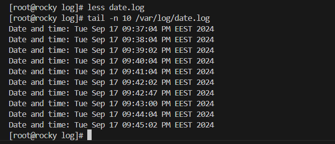

# lesson_6

# Завдання_1
_Встановити й налаштувати вебсервер Nginx через офіційний репозиторій. Додати й видалити PPA-репозиторій для Nginx, а потім повернутися до офіційної версії пакета за допомогою ppa-purge._

1.1. Встановити й налаштувати вебсервер Nginx через офіційний репозиторій.

В моєму випадку, на системі Rocky Linux 9 (яка базується на Red Hat), немає підтримки PPA (Personal Package Archive), оскільки це специфічна технологія Ubuntu. 
Натомість я можу зробити це додавши офіційний репозиторій Nginx в ``` etc/yum.repos.d/nginx.repo ``` що чимось схоже з PPA.


```
[root@rocky vadym]# cat > /etc/yum.repos.d/nginx.repo

[nginx-stable]
name=nginx stable repo
baseurl=http://nginx.org/packages/centos/$releasever/$basearch/
gpgcheck=1
enabled=1
gpgkey=https://nginx.org/keys/nginx_signing.key
module_hotfixes=true

```
Далі оновлюю кеш репозиторіїв та встановлюю Nginx
```
[root@rocky vadym]# dnf makecache
```

```
[root@rocky vadym]# dnf install nginx -y
```


1.2. Додати й видалити PPA-репозиторій для Nginx, а потім повернутися до офіційної версії пакета за допомогою ppa-purge. 

Щоб видалити репозиторій, потрібно просто видалити ```.repo``` файл
```
[root@rocky vadym]# rm /etc/yum.repos.d/nginx.repo
```


Для повернення до стандартної версії пакета Nginx, можна виконати таку команду, яка видаляє поточну версію nginx
```
[root@rocky vadym]#  dnf remove nginx
```
Далі очистимо та оновлюємо кеш репозиторіїв. 
```
[root@rocky vadym]# sudo dnf clean all
30 files removed
[root@rocky vadym]# sudo dnf makecache
Rocky Linux 9 - BaseOS                                                                                                                      2.2 MB/s | 2.3 MB     00:01    
Rocky Linux 9 - AppStream                                                                                                                   4.4 MB/s | 8.0 MB     00:01    
Rocky Linux 9 - Extras                                                                                                                       17 kB/s |  15 kB     00:00    
Metadata cache created.
```

І після цього знову встановлюю стандартну версію Nginx з репозиторіїв rocky.
```
[root@rocky vadym]# dnf install nginx -y
```
Додаємо до автозавантаження
```
[root@rocky vadym]# systemctl enable nginx 
```
Стартуємо
```
[root@rocky vadym]# systemctl start nginx
```


# Завдання_2
_Написати й налаштувати власний systemd-сервіс для запуску простого скрипта (наприклад, скрипт, який пише поточну дату і час у файл щохвилини)._
```
[vadym@rocky DevOpsLecture]$ cd Lecture_6
[vadym@rocky Lecture_6]$ touch date.sh 
[vadym@rocky Lecture_6]$ chmod +x date.sh 
[vadym@rocky Lecture_6]$ ll
-rwxr-xr-x. 1 vadym vadym     0 Sep 16 17:15 date.sh

[vadym@rocky Lecture_6]$ cat date.sh
#!/bin/bash
echo "Date and time: $(date)" >> ~/DevOps/DevOpsLecture/Lecture_6/date.log # далі змінив розташування в /var/log/date.log

[vadym@rocky Lecture_6]$ ./date.sh
[vadym@rocky Lecture_6]$ ./date.sh
[vadym@rocky Lecture_6]$ ./date.sh
[vadym@rocky Lecture_6]$ cat date.log 
Date and time: Mon Sep 16 05:20:51 PM EEST 2024
Date and time: Mon Sep 16 05:20:58 PM EEST 2024
Date and time: Mon Sep 16 05:21:00 PM EEST 2024

[vadym@rocky Lecture_6]$ touch date.service
[vadym@rocky Lecture_6]$ cat date.service
[Unit]
Description=Write date and time to a log file
After=network.target

[Service]
ExecStart=/home/vadym/DevOps/DevOpsLecture/Lecture_6/date.sh  #далі змінив розташування /usr/local/bin/date.sh 
Type=oneshot

[Install]
WantedBy=multi-user.target

[vadym@rocky Lecture_6]$ touch date.timer
[vadym@rocky Lecture_6]$ cat date.timer 
[Unit]
Description=Run date service every minute

[Timer]
OnCalendar=*:0/1
Persistent=true

[Install]
WantedBy=timers.target
 
cp /home/vadym/DevOps/DevOpsLecture/Lecture_6/date.service /etc/systemd/system/
cp /home/vadym/DevOps/DevOpsLecture/Lecture_6/date.timer /etc/systemd/system/
cp /home/vadym/DevOps/DevOpsLecture/Lecture_6/date.sh /usr/local/bin/

systemctl daemon-reload
systemctl start date.service
systemctl start date.timer 
sudo systemctl status date.service
sudo systemctl status date.timer
```




# Завдання_3
_Налаштувати брандмауер за допомогою UFW або iptables. Заборонити доступ до порту 22 (SSH) з певного IP, але дозволити з іншого IP. Налаштувати Fail2Ban для захисту від підбору паролів через SSH._

Налаштовуємо iptables, зараз ніяких правил немає і є доступ з машинки 192.168.0.107 та 192.168.0.108

```
iptables -L
```


Додаємо правило що забороняє доступ по 22 порту для 192.168.0.107.

```
sudo iptables -A INPUT -s 192.168.0.107 -p tcp --dport 22 -j DROP
```


З адреси 192.168.0.107 з'єднання відсутнє.

А з адреси 192.168.0.108 з'єднання все ще є.


_Налаштовуємо Fail2Ban_

Спершу потрібно його встановити 

```
[root@rocky DevOpsLecture]#dnf install fail2ban -y
[root@rocky DevOpsLecture]# fail2ban-client -V
1.0.2
```


Далі по інструкції потрібно створити локальну копію конфігурації, щоб не змінювати оригінальний файл /etc/fail2ban/jail.conf, потрібно створити локальну копію, де будуть вноситися всі зміни.

```
[root@rocky DevOpsLecture]# cp /etc/fail2ban/jail.conf /etc/fail2ban/jail.local
```
Додаю налаштування в конфіг
```
maxretry = 5: Максимальна кількість невдалих спроб входу до блокування IP (5 спроб).
bantime = 300: Час блокування IP (в секундах). 300 секунд = 5 хвилин.
findtime = 120: Вікно часу (в секундах), протягом якого враховуються невдалі спроби. Наприклад, якщо буде більше 5 спроб за 2 хвилини, IP буде заблокований.
```


Перезавантажую сервіс після внесення змін
```
[root@rocky DevOpsLecture]# systemctl restart fail2ban
[root@rocky DevOpsLecture]# systemctl enable fail2ban
```

Перевірка статусу fail2ban 
```
[root@rocky DevOpsLecture]# sudo fail2ban-client status sshd
```
Поки нічого немає.


Спробуємо з машинки 192.168.0.108 зробити 5 невдалих спроб входу.


Після 5-го введення невірного пароль, був заблокований доступ. 


file2ban додав правило до iptables 


Для того, щоб видалити машинку з бану потрібно виконати таку команду:
```
[root@rocky DevOpsLecture]# fail2ban-client set sshd unbanip 192.168.0.108
```

Як бачимо зникло правило з iptables, також в file2ban відсутня адреса 192.168.0.108

_Тепер ми знову можемо брутфорсити нашу віртуалку 5-ма спробами)))_


# Завдання_з_зірочкою
_Створити й змонтувати новий розділ на диску, налаштувати його для автоматичного монтування під час завантаження системи._

Додаю ще один диск до віртуалки


```
[root@rocky DevOpsLecture]# fdisk -l
```

```
[root@rocky /]# fdisk /dev/sdb
```

Cтворили новий розділ на диску /dev/sdb. 

Далі потрібно його відформатувати.
```
mkfs.ext4 /dev/sdb1
```
Далі потрібно його змонтувати, для цього створюю папку куди саме буду монтувати і монтую.
```
[root@rocky DevOpsLecture]$  mkdir /mnt/disk
[root@rocky disk]# mount /dev/sdb1 /mnt/disk/
```


_Налаштування автоматичного монтування під час завантаження_

Щоб новий розділ монтувався автоматично при кожному завантаженні системи, його потрібно додати в файл ``` /etc/fstab ```

Для цього нам потрібно дізнатись UUID нового розділу
```
[root@rocky disk]# blkid /dev/sdb1
/dev/sdb1: UUID="a47a9f7b-032b-4996-9538-e35c6d86bc98" TYPE="ext4" PARTUUID="b39fbf45-01"
```
потім дописати в файл ``` /etc/fstab ```


Після перезавантаження диск автоматично примонтувався


The End!